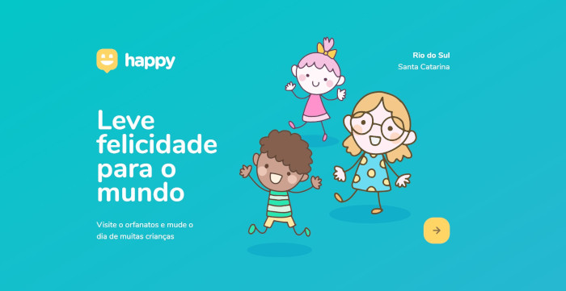
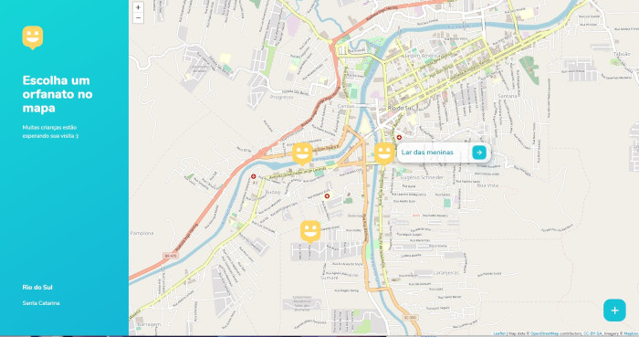

<h1 align="center">
 </h1>
<i>
Projeto web/mobile desenvolvido durante a semana Next Level Week #3  da Rocketseat.</i>

<a href="https://github.com/jessiarrais/Happy-NWL#rocket-sobre-o-projeto">Sobre</a> •
<a href="https://github.com/jessiarrais/Happy-NWL#rocket-layout">Layout</a> •
<a href="https://github.com/jessiarrais/Happy-NWL#rocket-tecnologias">Tecnologias</a> •
<a href="https://github.com/jessiarrais/Happy-NWL#rocket-license">License</a> •

<h4 align="center"> Projeto concluído! :rocket: </h4>

<h3>:rocket: #Sobre o projeto:</h3>
Projeto desenvolvido durante a semana <strong>Next Level Week</strong>, da <strong><a href="https://rocketseat.com.br/">Rocketseat</a></strong>, do dia 12 a 18 de Outubro de 2020.

Tem como objetivo levar as pessoas a encontrar e visitar um orfanato da cidade, podendo também cadastrar um orfanato no mapa, com as informações necessárias.

<h3>:rocket: #Layout:</h3>

O layout também pode ser encontrado no <a href="https://www.figma.com/">Figma</a>:

<ul>
<li><a href="https://www.figma.com/file/viYD1xIddtZdGUFZQ8yTBe/Happy-Web-Copy?node-id=0%3A1">Layout Web</a></li>

 <li><a href="https://www.figma.com/file/X27FfVxAgy9f5IFa7ONlph/Happy-Mobile?node-id=0%3A1">Layout Mobile</a> 
</li></ul>
Para isso você precisa ter uma conta para acessá-lo. 

<h3>:rocket: #Tecnologias:</h3>

 As seguintes ferramentes foram usadas na construção do projeto: 

- [Node.js](https://nodejs.org/en/)
- [Express](https://expressjs.com/pt-br/)
- [SQLite](https://www.sqlite.org/index.html)
- [JavaScript](https://developer.mozilla.org/pt-BR/docs/Web/JavaScript)
- [Handlebars](https://handlebarsjs.com/)
- [HTML](https://developer.mozilla.org/pt-BR/docs/Web/HTML)
- [CSS](https://developer.mozilla.org/pt-BR/docs/Web/CSS)

<h3>:rocket: #License:</h3>

Este projeto está sob a licença <a href="https://github.com/jessiarrais/Happy-NWL/blob/add-license-1/LICENSE"</a>MIT.

